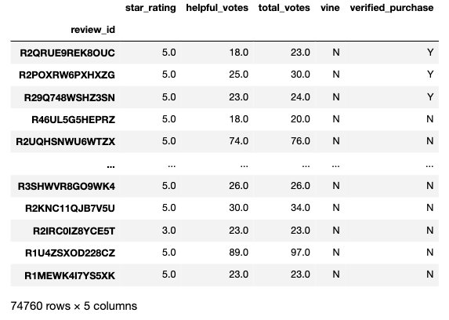
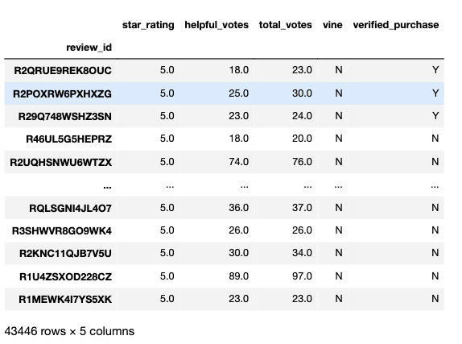
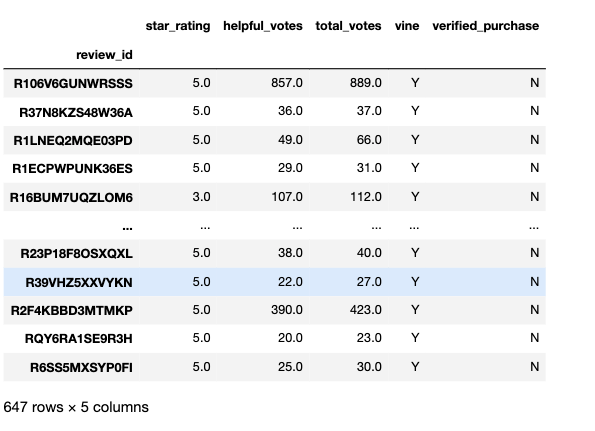
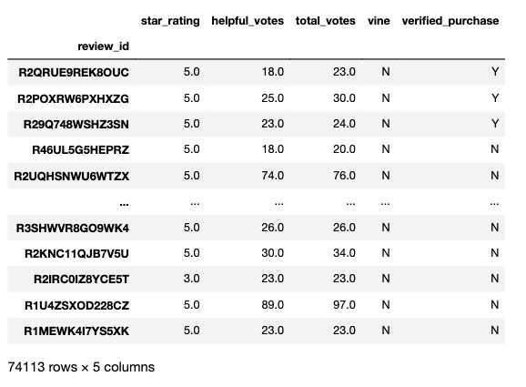
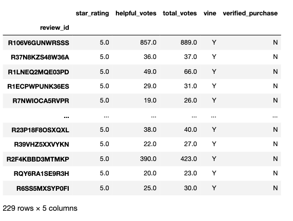
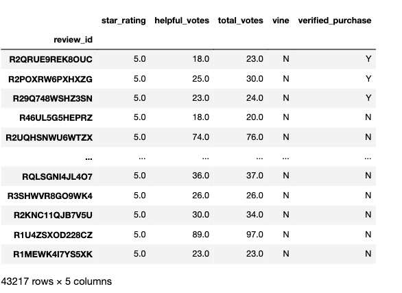
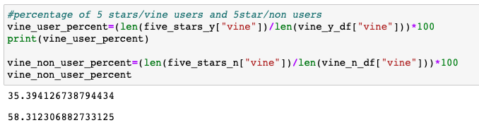
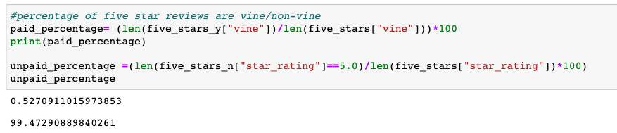
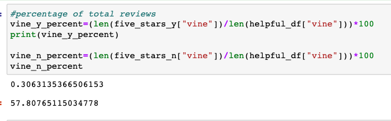

# Amazon_Vine_Analysis
### Big Data

## Overview of the Analysis

The purpose of this analysis is to extract, transform and load the Amazon review dataset from a S3 bucket in an RDS database to a pandas file where we can perform analyses on a table of interest, which has been exported as a csv from Postgres SQL.

The dataset I chose to analyze is reviews of beauty products available on Amazon.

Once we extracted the valuable data from the original dataset, our purpose is to discern if there is any bias towards favourable reviews from Vine members in our dataset.

Please note that the vine_table.csv dataset had to be compressed in order to be published on github, due to size constraints.

## Results

<b>Total Cleaned Sample Reviews</b>
   
 Criteria - To be considered for this dataset, the total votes must greater or equal to 20, and helpful_votes/total_votes are 50% or higher.

</img>

- The total number of reviews that are eligible for this analysis is 74,760.

<b>Total Five Star reviews</b>

</img>

- The total number of 5 star reviews in the complete dataset are 43,446

### How many Vine reviews and non-Vine reviews were there?

<b>Total Vine Reviews</b>

</img>

- The total number of reviews that have a vine membership is quite small(647) compared to the total sample, as it is only 0.86% of the total number of reviews.

<b>Total Non-Vine Reviews</b>
</img>

- The remaining reviews are made by non-vine users, which come up to 74,113 reviews.

### How many Vine reviews were 5 stars? How many non-Vine reviews were 5 stars?

<b>Total Vine Five Star Reviews</b>
</img>

- The total number of reviews for vine users is 647. The number of five star reviews of that subset is 229.

<b>Total Non-Vine Five Star Reviews</b>
</img>

- The total number of five star reviews from non-vine users is 43,217 out of the 74,113 total reviews.

### What percentage of Vine reviews were 5 stars? What percentage of non-Vine reviews were 5 stars?

</img>
- The percentage of five star reviews out of the total vine users reviews subset is 35.39%.

- The number of five star(non-vine) reviews is 58.31% of the total non-vine user reviews.

</img>
- Other percentages of note are the percentage of vine five star reviews to total five star reviews. The vine five star reviews make up 0.53% of the total  of all five star reviews, where as the non vine five star reviews make up the remaining 99.47%.

</img>
 - Finally the total number of vine user five star reviews out of the total number of reviews is 
 0.31%, versus the non-vine five star reviews making up 57.81% of the total reviews.

## Summary
In summary, based on our current dataset, positive bias doesn't appear to be present in the Vine program. The percentage of vine reviewer's who give a five star review of the product is 35.39%. This is compared to the percentage of five star reviews given by non vine reviewers, which is 58.31%. From this data, we can extrapolate that there is no positivity bias and that Vine reviewers seem to be more likely to give a non-positive review to a product than non-vine users.

Despite this, we should be cautious drawing a final conclusion from this dataset alone because the sample of vine users in the Beauty review dataset was a fraction of the size of the non-vine reviewers set. Before drawing a definitive conclusion, it would be worth conducting similar reviews over time to discover if this was a trend within beauty reviewers.

An additional analysis to perform on this data set would be to establish the measures of central tendency (mean, median, mode) on the star_rating variable. This would be useful to see if the data is skewed either way. We could then see what the average star ratings were for Vine and non-vine reviewers. This would likely support our summary that Vine reviewers are more likely to give a lower rating.

It would also be useful to compare the mean, median to the mean, median of the population of all beauty reviews (or even amazon reviews) to determine if the conclusion found in from this dataset can be reproduced.

Once we had dug into the data a little bit further, we could devise a two sample t-test to determine if the mean and medians of the two sets (vine/non vine) were also statistically significant.